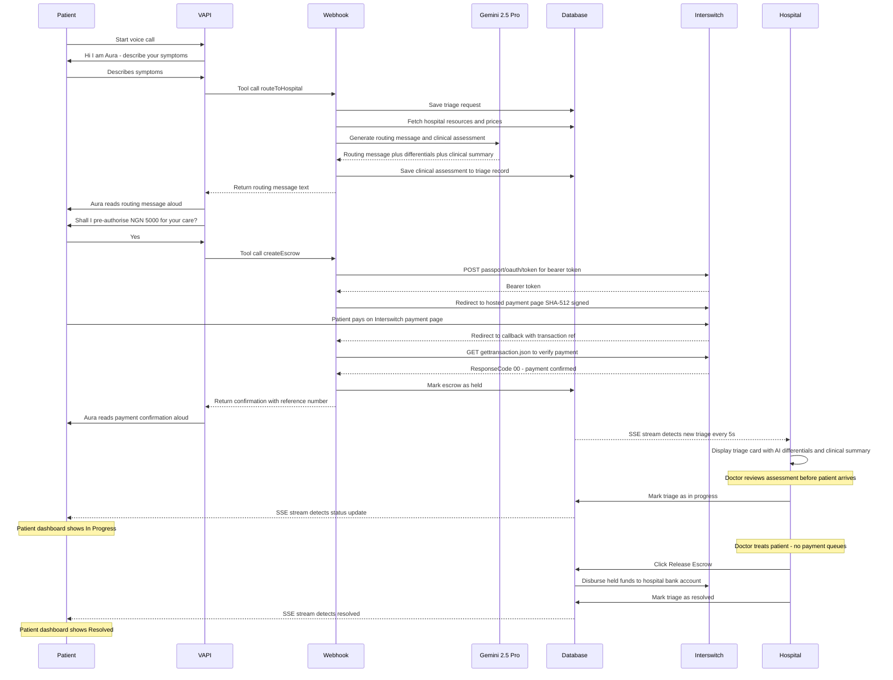

# AuraHealth — Enyata × Interswitch Buildathon Submission

> **Powered by Interswitch QuickTeller — eliminating Nigeria's hospital payment queues through AI triage and escrow-backed care**

**Live Link:** https://aurahealth-five.vercel.app

---

## Interswitch APIs Used

| API | Endpoint | Purpose |
|-----|----------|---------|
| OAuth 2.0 token | `POST /passport/oauth/token` | Authenticate every server-side request to Interswitch |
| Hosted payment page | `GET /collections/w/pay` | Patient pays escrow — card, bank transfer, or USSD |
| Transaction verification | `GET /collections/api/v1/gettransaction.json` | Server-side confirmation before funds are marked as held |
| *(Next)* Identity verification | Interswitch KYC API | Verify patient and hospital identity at onboarding |

All three live APIs run against the **QuickTeller Business Sandbox** (`sandbox.interswitchng.com`). The integration is in [`src/lib/interswitch.ts`](src/lib/interswitch.ts) and [`src/app/api/escrow/callback/route.ts`](src/app/api/escrow/callback/route.ts).

---

## The Problem

A patient in a Nigerian emergency faces a payment queue at every stage of care:

- Admission desk — pay to register
- Ward allocation — pay for bed
- Diagnostics — pay for labs and imaging
- Pharmacy — pay for each medication
- Procedures — pay per intervention

Each payment is separate, often requires cash, and must be settled *before* care is delivered. This costs time — and lives.

AuraHealth eliminates this queue entirely. A single voice call to our AI agent covers the full episode of care in advance, routed to the right hospital with the right resources.

---

## How It Works

### Step 1 — The Hospital Gets Ready

A hospital signs up at [/signup](https://aurahealth-five.vercel.app/signup) and is **auto-approved** — their dashboard opens immediately. A setup modal prompts them to fill in:

- Description, specialties, emergency phone number
- Number of general beds, ICU slots
- A resource inventory — each item with a name, category, available count, and price in ₦ (e.g. General Bed ₦15,000/night, ICU ₦80,000/night, CT Scan ₦25,000)

This resource inventory is what feeds the AI agent. When a patient calls, Aura already knows exactly what the hospital has available and at what price — before she asks a single question.

The hospital also registers their bank account. This is where Interswitch disburses the escrow balance when the hospital marks treatment complete.

---

### Step 2 — The Patient Signs Up and Links to a Hospital

A patient signs up at [/signup](https://aurahealth-five.vercel.app/signup). They are automatically matched to an available hospital, or they can search and request a specific one from their dashboard at [/dashboard/patient](https://aurahealth-five.vercel.app/dashboard/patient).

The patient also links a payment source — a debit card, bank account, or HMO/insurance policy. AuraHealth stores a reference to this source (not the raw card data). This is the account that gets charged when they confirm payment during a triage call.

---

### Step 3 — The Patient Calls Aura

The patient opens their dashboard and taps **"Start Voice Triage"** — a live browser call starts immediately via VAPI. Or they can call directly on `+17622204588`.

**Aura answers.** She runs on GPT-4o (conversation), Deepgram nova-3-medical (clinical-grade transcription), and ElevenLabs (voice synthesis).

Aura asks: *"Hi, I am Aura. What brings you in today?"*

The patient describes their symptoms in plain speech. Aura listens, assesses severity (critical / high / medium / low), and decides it is time to route.

---

### Step 4 — Aura Contacts Our Server (The Tool Call)

When Aura has enough information, she internally triggers a **server tool call** — VAPI sends a POST request to our webhook at `/api/vapi/webhook` with the symptoms and severity. Our server then does four things:

1. **Creates a triage record** in the database — patient, symptoms, severity, timestamp
2. **Fetches the hospital's live resource inventory** — what is available and at what price right now
3. **Sends everything to Gemini 2.5 Pro** (via Google Vertex AI) — symptoms, severity, hospital resources — and asks it to generate:
   - A warm routing message to read aloud to the patient
   - 3–5 differential diagnoses (medical terms for the doctor)
   - A clinical summary paragraph for the receiving doctor
4. **Saves the differentials and clinical summary** back to the triage record

Our server returns the routing message as plain text. VAPI reads it aloud to the patient immediately.

---

### Step 5 — Payment Pre-Authorisation via Interswitch

Right after routing, Aura asks: *"Shall I pre-authorise ₦5,000 for your care? This guarantees you will not face any payment queues on arrival."*

The patient says **"Yes"**. VAPI fires a second tool call — `createEscrow`. Our server:

1. Creates an escrow record in the database
2. Gets an **OAuth 2.0 Bearer token** from Interswitch (`POST /passport/oauth/token`)
3. Builds a **SHA-512 signed redirect URL** for the Interswitch hosted payment page
4. Charges the patient's linked payment source via Interswitch
5. Interswitch redirects the patient back to `/api/escrow/callback`
6. We verify the transaction (`GET /collections/api/v1/gettransaction.json`) — response code `"00"` means success
7. Escrow is marked **"held"** — money is locked with AuraHealth until the hospital releases it

Aura reads back the confirmation and reference number. The patient is done — no browser, no card entry, no queues.

---

### Step 6 — The Hospital Dashboard Lights Up

While all of this is happening, the hospital dashboard is **listening via SSE** (Server-Sent Events). Our stream endpoint at `/api/triage/stream` polls the database every 5 seconds and pushes any new or updated triages to the connected hospital browser.

The moment the triage is created, a new card appears in the hospital's **Triage** tab showing:
- Patient name and symptoms
- Severity badge (CRITICAL / HIGH / MEDIUM / LOW)
- **Clinical AI Assessment** — the differential diagnoses and clinical summary Gemini generated

The doctor reads the AI assessment **before the patient walks through the door.**

---

### Step 7 — The Patient Arrives, No Payment Friction

The patient arrives. The doctor already knows what is likely wrong. There is no admission desk payment, no pharmacy queue, no diagnostic payment. The escrow covers everything.

The doctor opens the triage card and clicks **"Mark In Progress"**. The patient's dashboard updates in real time via their own SSE stream — their triage card flips to "In Progress."

---

### Step 8 — Treatment Complete, Escrow Released

When treatment is done, the hospital clicks **"Release Escrow"** on the triage card. AuraHealth triggers Interswitch to disburse the held funds directly to the hospital's registered bank account. The patient's dashboard updates to "Resolved."

The full episode of care — from first symptom description to final payment — is settled without the patient ever stopping to pay.

---

## Payment Architecture

AuraHealth sits at the centre of every transaction — not as a bank, but as a **payment orchestrator**. Here is how money flows:

```text
Patient payment source          AuraHealth Escrow           Hospital bank account
──────────────────────          ─────────────────           ─────────────────────
 Card / Bank account  ───────►  Holds funds until  ──────►  Registered Interswitch
 HMO / Insurer                  treatment confirmed          merchant account
```

**Why this works:**

1. **Hospital registers a bank account** with AuraHealth at onboarding. Interswitch has this account on file as the merchant destination for escrow disbursements. The hospital never handles card data.

2. **Patient links a payment source** — a debit card, a bank account (direct debit), or an HMO/insurance policy number. AuraHealth stores the source reference, not the raw card data.

3. **During a voice triage**, Aura confirms the estimated cost and the patient says "Yes". AuraHealth debits the patient's linked source via Interswitch's hosted payment page and holds the funds in escrow.

4. **At each stage of in-hospital care** — bed, labs, pharmacy, procedures — the hospital can draw from the escrow balance. No cash, no new queue.

5. **When care is complete**, the hospital clicks Release Escrow. Interswitch transfers the balance from the escrow hold to the hospital's registered bank account. The patient receives an itemised receipt.

6. **If the patient has HMO coverage**, the insurer is billed instead of (or alongside) the patient's bank account. The hospital still receives the same guaranteed payment — the source is abstracted away.

---

## Full Sequence Diagram



---

## Architecture

```
Patient Browser
  └── VoiceTriage.tsx (@vapi-ai/web WebRTC)
        └── VAPI Cloud (GPT-4o + Deepgram nova-3-medical + ElevenLabs)
              └── POST /api/vapi/webhook
                    ├── createTriageRequest()       → DB
                    ├── getHospitalResources()      → DB
                    ├── generateText(gemini-2.5-pro)→ Vertex AI
                    │     returns: routingMessage + differentials + clinicalSummary
                    └── initializeMockEscrow()      → DB / Interswitch

Hospital Browser
  └── TriageInbox.tsx (EventSource)
        └── GET /api/triage/stream?hospitalId=...
              └── DB poll every 5s → push new + updated triages

Patient Browser
  └── PatientDashboardView (EventSource)
        └── GET /api/events/patient-stream?patientId=...
              └── DB poll → push link approval + triage status changes
```

---

## APIs Used

### Interswitch QuickTeller Business — Payments & Escrow

> **Environment:** Sandbox (`sandbox.interswitchng.com`)

AuraHealth uses the Interswitch QuickTeller Business API for all payment operations. The integration uses three distinct API surfaces:

| Step | API | When |
|------|-----|------|
| Get bearer token | `POST /passport/oauth/token` (Basic auth, `client_credentials`) | Before every payment or query |
| Redirect to payment page | `GET /collections/w/pay?merchant_code=...&hash=...` | Patient pre-authorises escrow during triage |
| Verify transaction | `GET /collections/api/v1/gettransaction.json` (Bearer token) | After patient returns from payment page (`/api/escrow/callback`) |

**Hash formula (SHA-512):** The payment page redirect requires a request signature:

```text
SHA512( txnRef + productId + payItemId + amountKobo + redirectUrl + macKey )
```

All values are concatenated with no separator. Amount must be in kobo (₦ × 100). This is the official Interswitch DocBase formula (`request-hash-calculation`).

**Response code `"00"`** = successful payment. Any other code means the payment did not go through and the escrow stays pending.

**Coming next — Interswitch Identity Verification:** We will integrate Interswitch's identity verification API to KYC patients and hospitals at onboarding, ensuring that the person pre-authorising payment is who they claim to be. This is especially important for HMO-linked accounts where a patient's insurer covers the escrow amount.

---

### VAPI — Voice AI Platform

> **Docs:** https://docs.vapi.ai

VAPI hosts the Aura voice agent and manages the full WebRTC session.

| Component | Value |
|-----------|-------|
| Model | GPT-4o (conversation) |
| Transcription | Deepgram nova-3-medical (clinical accuracy) |
| Voice synthesis | ElevenLabs — "Burt" voice |
| Phone number | `+17622204588` |
| HIPAA compliant | Yes |

VAPI calls our server at `/api/vapi/webhook` when the agent decides to invoke a tool (`routeToHospital`, `createEscrow`). We return a text string that VAPI reads aloud to the patient.

---

### Google Vertex AI — Gemini 2.5 Pro

> **Project:** `ai-projects-481815` · **Region:** `us-central1`

Used inside the VAPI webhook to generate three things per triage:

1. **Routing message** — warm, personalised sentence the voice agent reads aloud
2. **Differential diagnoses** — 3–5 likely clinical diagnoses as a JSON array
3. **Clinical summary** — one-paragraph reasoning for the receiving doctor

Gemini receives: patient symptoms, severity score, hospital specialties, and live resource availability (beds, ICU, prices). It returns structured JSON.

**SDK:** `@ai-sdk/google-vertex` via Vercel AI SDK `generateText()`. Auth via service account JSON in `GOOGLE_VERTEX_CREDENTIALS`.

---

### VAPI Webhook — Server Tools

Our `/api/vapi/webhook` (Next.js Route Handler) implements two VAPI server tools:

**`routeToHospital`**
```
Input:  { symptoms: string, severity: "critical"|"high"|"medium"|"low" }
Action: createTriageRequest() → getHospitalResources() → Gemini generateText()
Output: routing message string (read aloud by Aura)
```

**`createEscrow`**
```
Input:  { amountNaira: number }
Action: getLatestTriageForPatient() → initializeEscrow() → linkEscrowToTriage()
Output: confirmation string with transaction reference
```

---

### Neon PostgreSQL — Database

> **Driver:** `@neondatabase/serverless` (HTTP, edge-compatible)

All data is stored in a single Neon database. Tables:

| Table | Purpose |
|-------|---------|
| `user` | Patients, hospitals, and admin accounts |
| `session` / `account` | Better Auth session management |
| `patient_hospital_link` | Hospital–patient relationship (pending/approved) |
| `emr_record` | Imported EMR records per hospital |
| `hospital_profile` | Description, specialties, bed count, ICU count |
| `hospital_resource` | Resource inventory with prices |
| `triage_request` | Full triage record incl. differentials + clinical summary |
| `escrow_transaction` | Payment escrow lifecycle |

---

### Better Auth — Authentication

> **Version:** 1.5.6

Handles signup, login, session management, and password reset. Custom fields (`role`, `phoneNumber`, `isApproved`) are passed via `inferAdditionalFields`. All auth routes live at `/api/auth/[...all]`.

---

## Tech Stack

| Layer      | Technology                                                     |
| ------------| ----------------------------------------------------------------|
| Framework  | Next.js 16.2 (App Router, Partial Prerender, Cache Components) |
| Runtime    | Bun 1.x                                                        |
| Auth       | Better Auth 1.5.6 with Drizzle adapter                         |
| Database   | Neon PostgreSQL (serverless HTTP)                              |
| ORM        | Drizzle ORM 0.45                                               |
| Styling    | Tailwind CSS v4                                                |
| Voice AI   | VAPI (GPT-4o, Deepgram nova-3-medical, ElevenLabs)             |
| AI Routing | Vercel AI SDK + @ai-sdk/google-vertex (Gemini 2.5 Pro)         |
| Payments   | Interswitch QuickTeller sandbox (escrow lifecycle)             |
| Real-time  | Server-Sent Events (triage alerts + patient updates)           |

---

## Features

- [x] Hospital auto-approval on signup — profile setup modal opens on first login
- [x] Hospital profile: description, specialties, bed count, ICU count, emergency phone
- [x] Hospital resource inventory: name, category, available count, price in ₦ (feeds AI routing)
- [x] Hospital sidebar dashboard — Overview, Triage, Patients, Resources, Profile tabs
- [x] Patient registration with EMR-based hospital matching
- [x] Patient payment source linking: card, bank account, or HMO/insurer
- [x] Voice triage agent — Aura (VAPI, browser WebRTC + phone `+17622204588`)
- [x] Text-based triage fallback
- [x] Severity assessment (critical / high / medium / low)
- [x] AI clinical differentials and clinical summary per triage case (Gemini 2.5 Pro)
- [x] Hospital resource availability factored into AI routing
- [x] Real-time triage alerts to hospital dashboard (SSE, poll every 5s)
- [x] Real-time triage status updates to patient dashboard (SSE)
- [x] Real-time patient-approval event to hospital dashboard (SSE)
- [x] Triage status lifecycle: pending → in_progress → resolved
- [x] Escrow pre-authorisation per triage (Interswitch QuickTeller sandbox)
- [x] Correct SHA-512 hash formula per Interswitch DocBase
- [x] Escrow release from hospital triage card (disburses to hospital bank account)
- [x] EMR import (fake FHIR dataset, 15 patients)
- [x] Linked patients panel (AuraHealth + EMR tabs)
- [x] Admin dashboard for hospital approvals (manual override available)
- [x] Password visibility toggle on all auth forms
- [x] Responsive UI — mobile bottom nav on patient + hospital dashboards

---

## Pages

| URL | Who uses it |
|-----|------------|
| [/](https://aurahealth-five.vercel.app/) | Landing page |
| [/signup](https://aurahealth-five.vercel.app/signup) | Patient or hospital registration |
| [/login](https://aurahealth-five.vercel.app/login) | Patient or hospital login |
| [/dashboard/patient](https://aurahealth-five.vercel.app/dashboard/patient) | Patient dashboard — voice triage, history, escrow |
| [/dashboard/hospital](https://aurahealth-five.vercel.app/dashboard/hospital) | Hospital dashboard — triage inbox, patients, resources |
| [/admin](https://aurahealth-five.vercel.app/admin) | Admin — approve/reject hospital registrations |
| [/admin/login](https://aurahealth-five.vercel.app/admin/login) | Admin login |
| [/pending](https://aurahealth-five.vercel.app/pending) | Hospital awaiting admin approval |

---

## Getting Started

### Prerequisites

- [Bun](https://bun.sh) >= 1.0
- PostgreSQL database ([Neon](https://neon.tech) recommended)
- [VAPI](https://vapi.ai) account + assistant
- Google Cloud project with Vertex AI API enabled

### Environment Variables

```env
# Database
DATABASE_URL=postgresql://...

# Better Auth
BETTER_AUTH_URL=http://localhost:3000
BETTER_AUTH_SECRET=your_32_char_secret_here

# App
NEXT_PUBLIC_APP_URL=http://localhost:3000

# VAPI — Voice AI
VAPI_API_KEY=your_vapi_private_key
NEXT_PUBLIC_VAPI_PUBLIC_KEY=your_vapi_public_key
NEXT_PUBLIC_VAPI_ASSISTANT_ID=your_assistant_id
NEXT_PUBLIC_VAPI_PHONE_NUMBER=+17622204588

# Google Vertex AI — Gemini 2.5 Pro
GOOGLE_VERTEX_PROJECT=your_gcp_project_id
GOOGLE_VERTEX_LOCATION=us-central1
GOOGLE_VERTEX_CREDENTIALS={"type":"service_account",...}

# Interswitch QuickTeller Business (Sandbox)
NEXT_PUBLIC_INTERSWITCH_ENV=sandbox
INTERSWITCH_CLIENT_ID=your_client_id
INTERSWITCH_SECRET=your_secret_key
INTERSWITCH_MERCHANT_CODE=your_merchant_code
INTERSWITCH_PAY_ITEM_ID=your_pay_item_id
INTERSWITCH_PRODUCT_ID=your_numeric_product_id
INTERSWITCH_MAC_KEY=your_mac_key
```

### Installation

```bash
bun install
bunx drizzle-kit push   # push schema to database
bun dev                 # start dev server at http://localhost:3000
```

### Production Build

```bash
bun run build
bun start
```

---

## Project Structure

```
src/
├── app/
│   ├── admin/                   # Admin dashboard
│   ├── api/
│   │   ├── auth/                # Better Auth handler
│   │   ├── escrow/callback/     # Interswitch payment callback
│   │   ├── events/patient-stream/ # SSE — patient dashboard updates
│   │   ├── triage/stream/       # SSE — hospital triage alerts
│   │   └── vapi/webhook/        # VAPI tool call handler
│   ├── dashboard/
│   │   ├── hospital/            # Hospital dashboard
│   │   └── patient/             # Patient dashboard
│   └── page.tsx                 # Landing page
├── components/
│   └── VoiceTriage.tsx          # VAPI browser voice widget
├── lib/
│   ├── auth.ts                  # Better Auth server config
│   ├── db/schema.ts             # Full database schema
│   └── interswitch.ts           # Interswitch payment utilities
└── modules/
    ├── dashboard/hospital/      # Triage inbox, patients, profile, resources
    ├── dashboard/patient/       # Voice triage, history, escrow
    ├── escrow/                  # Escrow actions
    ├── hospital/                # Hospital profile + resource actions
    └── triage/                  # Triage CRUD + severity scoring
```

---

## Team

**Halleluyah Darasimi Oludele** — Team Lead & Software Engineer
Full-stack engineer responsible for the entire technical implementation: Next.js 16.2 architecture, VAPI voice integration, Gemini 2.5 Pro routing via Vertex AI, Interswitch escrow lifecycle, real-time SSE infrastructure, database schema design, and authentication.

**Theophilus Ayomide Olayiwola** — Product Manager & Product Designer
Responsible for product strategy, user research, UX design, and defining the problem space. Shaped the product vision from the patient and hospital perspective — particularly the insight that payment friction at every care stage is the core problem to solve.

---

## The Core Insight

> Nigerian hospitals collect payment at every queue. AuraHealth collapses all of those queues into a single pre-authorised escrow created during a 90-second voice call.

The patient never stops to pay again. The hospital is guaranteed payment at every stage. AuraHealth sits in the middle — routing intelligently, settling atomically, and giving doctors AI-generated clinical context before the patient even arrives.

---

*Built with Next.js 16.2, VAPI, Gemini 2.5 Pro (Vertex AI), Interswitch, and Neon PostgreSQL*
