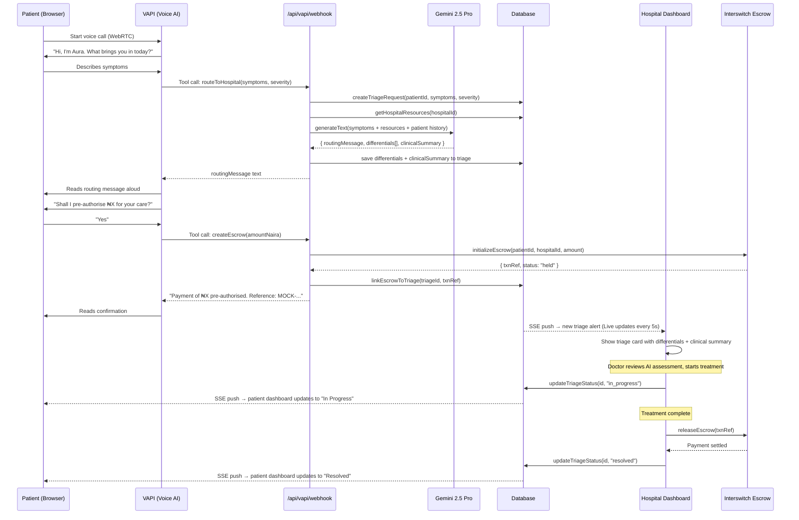

# AuraHealth — Enyata × Interswitch Buildathon Submission

> **Intelligent hospital triage, care coordination, and end-to-end payment orchestration for Nigeria**

**Live Demo:** https://aurahealth-five.vercel.app

---

## The Problem

A patient in a Nigerian emergency faces a payment queue at every stage of care:

- Admission desk — pay to register
- Ward allocation — pay for bed
- Diagnostics — pay for labs and imaging
- Pharmacy — pay for each medication
- Procedures — pay per intervention

Each payment is separate, often requires cash, and must be settled *before* care is delivered. This costs time — and lives.

AuraHealth eliminates this queue entirely. A single voice call to our AI agent covers the full episode of care in advance, routed to the right hospital with the right resources.

---

## How It Works

### 1. Hospital Onboarding

| Step | Actor | Page |
|------|-------|------|
| Register with name, email, specialties | Hospital | [/signup](https://aurahealth-five.vercel.app/signup) |
| Review and approve/reject | Admin | [/admin](https://aurahealth-five.vercel.app/admin) |
| Set hospital profile, resources & prices | Hospital | [/dashboard/hospital](https://aurahealth-five.vercel.app/dashboard/hospital) |

The hospital fills in its resource inventory — beds, ICU slots, lab kits, surgical teams — each with a count and a price in ₦. These feed directly into the AI agent's routing decisions.

### 2. Patient Onboarding

| Step | Actor | Page |
|------|-------|------|
| Register with name, email, phone | Patient | [/signup](https://aurahealth-five.vercel.app/signup) |
| Auto-matched to an approved hospital | System | — |
| Optionally link to a specific hospital | Patient → Hospital | [/dashboard/patient](https://aurahealth-five.vercel.app/dashboard/patient) |

### 3. Emergency — Voice Triage with Aura

The patient opens their dashboard and taps **"Start Voice Triage"**. Aura, our AI nurse, answers immediately.

1. Aura asks about symptoms in plain conversational language
2. Aura assesses severity (critical / high / medium / low)
3. Aura checks the hospital's live resource availability and prices
4. Aura routes the patient to their linked hospital, reads a personalised message, and names the care pathway
5. Aura confirms the total estimated cost and asks to pre-authorise payment
6. Patient confirms — escrow is created instantly via Interswitch
7. The hospital's triage inbox receives a real-time alert via SSE

The doctor sees the triage card with **differential diagnoses** and a **clinical summary** generated by Gemini 2.5 Pro — not just symptoms.

### 4. In-Hospital Care (Zero Payment Friction)

Once admitted, the patient never joins another payment queue. Each stage of care — bed allocation, labs, medication, procedures — draws from the pre-authorised escrow held by AuraHealth. The hospital requests a release per item; AuraHealth verifies and releases.

When care is complete, the hospital clicks **Release Escrow** on the triage card and the full balance settles via Interswitch.

---

## Full Sequence Diagram



---

## Architecture

```
Patient Browser
  └── VoiceTriage.tsx (@vapi-ai/web WebRTC)
        └── VAPI Cloud (GPT-4o + Deepgram nova-3-medical + ElevenLabs)
              └── POST /api/vapi/webhook
                    ├── createTriageRequest()       → DB
                    ├── getHospitalResources()      → DB
                    ├── generateText(gemini-2.5-pro)→ Vertex AI
                    │     returns: routingMessage + differentials + clinicalSummary
                    └── initializeMockEscrow()      → DB / Interswitch

Hospital Browser
  └── TriageInbox.tsx (EventSource)
        └── GET /api/triage/stream?hospitalId=...
              └── DB poll every 5s → push new + updated triages

Patient Browser
  └── PatientDashboardView (EventSource)
        └── GET /api/events/patient-stream?patientId=...
              └── DB poll → push link approval + triage status changes
```

---

## Tech Stack

| Layer | Technology |
|-------|-----------|
| Framework | Next.js 16.2 (App Router, Partial Prerender, Cache Components) |
| Runtime | Bun 1.x |
| Auth | Better Auth 1.5.6 with Drizzle adapter |
| Database | Neon PostgreSQL (serverless HTTP) |
| ORM | Drizzle ORM 0.45 |
| Styling | Tailwind CSS v4 |
| Voice AI | VAPI (GPT-4o, Deepgram nova-3-medical, ElevenLabs) |
| AI Routing | Vercel AI SDK + @ai-sdk/google-vertex (Gemini 2.5 Pro) |
| Payments | Interswitch QuickTeller (escrow lifecycle) |
| Real-time | Server-Sent Events (triage alerts + patient updates) |

---

## Features

- [x] Hospital registration with admin approval workflow
- [x] Hospital profile: description, specialties, bed count, ICU count, emergency phone
- [x] Hospital resource inventory: name, category, available count, price in ₦
- [x] Patient registration with EMR-based hospital matching
- [x] Voice triage agent — Aura (VAPI, browser WebRTC + phone `+17622204588`)
- [x] Text-based triage fallback
- [x] Severity assessment (critical / high / medium / low)
- [x] AI clinical differentials and clinical summary per triage case (Gemini 2.5 Pro)
- [x] Hospital resource availability factored into AI routing
- [x] Real-time triage alerts to hospital dashboard (SSE)
- [x] Real-time triage status updates to patient dashboard (SSE)
- [x] Real-time patient-approval event to hospital dashboard (SSE)
- [x] Triage status lifecycle: pending → in_progress → resolved
- [x] Escrow pre-authorisation per triage (Interswitch / mock)
- [x] Escrow release from hospital triage card
- [x] EMR import (fake FHIR dataset, 15 patients)
- [x] Linked patients panel (AuraHealth + EMR tabs)
- [x] Admin dashboard for hospital approvals
- [x] Password visibility toggle on all auth forms
- [x] Responsive UI — mobile bottom nav on patient + hospital dashboards

---

## Pages

| URL | Who uses it |
|-----|------------|
| [/](https://aurahealth-five.vercel.app/) | Landing page |
| [/signup](https://aurahealth-five.vercel.app/signup) | Patient or hospital registration |
| [/login](https://aurahealth-five.vercel.app/login) | Patient or hospital login |
| [/dashboard/patient](https://aurahealth-five.vercel.app/dashboard/patient) | Patient dashboard — voice triage, history, escrow |
| [/dashboard/hospital](https://aurahealth-five.vercel.app/dashboard/hospital) | Hospital dashboard — triage inbox, patients, resources |
| [/admin](https://aurahealth-five.vercel.app/admin) | Admin — approve/reject hospital registrations |
| [/admin/login](https://aurahealth-five.vercel.app/admin/login) | Admin login |
| [/pending](https://aurahealth-five.vercel.app/pending) | Hospital awaiting admin approval |

---

## Getting Started

### Prerequisites

- [Bun](https://bun.sh) >= 1.0
- PostgreSQL database ([Neon](https://neon.tech) recommended)
- [VAPI](https://vapi.ai) account + assistant
- Google Cloud project with Vertex AI API enabled

### Environment Variables

```env
# Database
DATABASE_URL=postgresql://...

# Better Auth
BETTER_AUTH_URL=http://localhost:3000
BETTER_AUTH_SECRET=your_32_char_secret_here

# App
NEXT_PUBLIC_APP_URL=http://localhost:3000

# VAPI — Voice AI
VAPI_API_KEY=your_vapi_private_key
NEXT_PUBLIC_VAPI_PUBLIC_KEY=your_vapi_public_key
NEXT_PUBLIC_VAPI_ASSISTANT_ID=your_assistant_id
NEXT_PUBLIC_VAPI_PHONE_NUMBER=+17622204588

# Google Vertex AI — Gemini 2.5 Pro
GOOGLE_VERTEX_PROJECT=your_gcp_project_id
GOOGLE_VERTEX_LOCATION=us-central1
GOOGLE_VERTEX_CREDENTIALS={"type":"service_account",...}
```

### Installation

```bash
bun install
bunx drizzle-kit push   # push schema to database
bun dev                 # start dev server at http://localhost:3000
```

### Production Build

```bash
bun run build
bun start
```

---

## Project Structure

```
src/
├── app/
│   ├── admin/                   # Admin dashboard
│   ├── api/
│   │   ├── auth/                # Better Auth handler
│   │   ├── escrow/callback/     # Interswitch payment callback
│   │   ├── events/patient-stream/ # SSE — patient dashboard updates
│   │   ├── triage/stream/       # SSE — hospital triage alerts
│   │   └── vapi/webhook/        # VAPI tool call handler
│   ├── dashboard/
│   │   ├── hospital/            # Hospital dashboard
│   │   └── patient/             # Patient dashboard
│   └── page.tsx                 # Landing page
├── components/
│   └── VoiceTriage.tsx          # VAPI browser voice widget
├── lib/
│   ├── auth.ts                  # Better Auth server config
│   ├── db/schema.ts             # Full database schema
│   └── interswitch.ts           # Interswitch payment utilities
└── modules/
    ├── dashboard/hospital/      # Triage inbox, patients, profile, resources
    ├── dashboard/patient/       # Voice triage, history, escrow
    ├── escrow/                  # Escrow actions
    ├── hospital/                # Hospital profile + resource actions
    └── triage/                  # Triage CRUD + severity scoring
```

---

## Team

**Halleluyah Darasimi Oludele** — Team Lead & Software Engineer
Full-stack engineer responsible for the entire technical implementation: Next.js 16.2 architecture, VAPI voice integration, Gemini 2.5 Pro routing via Vertex AI, Interswitch escrow lifecycle, real-time SSE infrastructure, database schema design, and authentication.

**Theophilus Ayomide Olayiwola** — Product Manager & Product Designer
Responsible for product strategy, user research, UX design, and defining the problem space. Shaped the product vision from the patient and hospital perspective — particularly the insight that payment friction at every care stage is the core problem to solve.

---

## The Core Insight

> Nigerian hospitals collect payment at every queue. AuraHealth collapses all of those queues into a single pre-authorised escrow created during a 90-second voice call.

The patient never stops to pay again. The hospital is guaranteed payment at every stage. AuraHealth sits in the middle — routing intelligently, settling atomically, and giving doctors AI-generated clinical context before the patient even arrives.

---

*Built with Next.js 16.2, VAPI, Gemini 2.5 Pro (Vertex AI), Interswitch, and Neon PostgreSQL*
